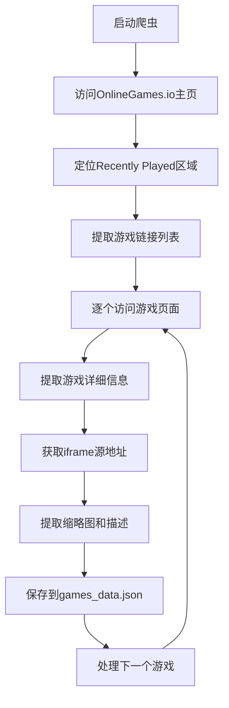
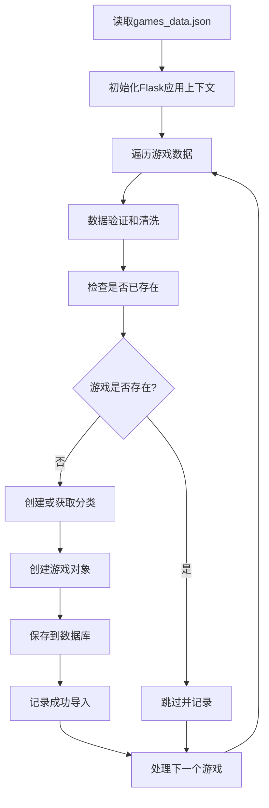
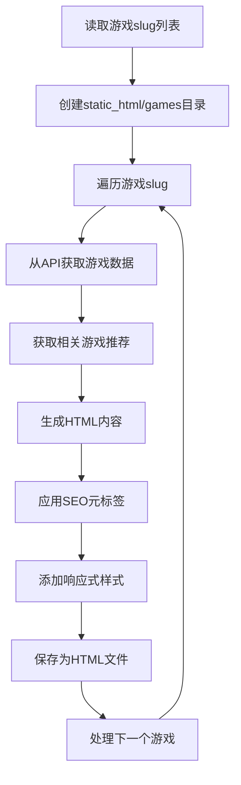

# 游戏数据处理与静态页面生成完整流程

## 概述

本文档详细描述了从爬取在线游戏网站数据，到导入数据库，再到生成静态HTML页面的完整工作流程。整个系统包含三个核心组件：

1. **analyze_onlinegames_structure.py** - 数据爬取脚本
2. **import_games_data.py** - 数据库导入脚本
3. **generate_static_pages.py** - 静态页面生成脚本

---

## 1. 数据爬取阶段

### 1.1 脚本功能

**文件**: `analyze_onlinegames_structure.py`

该脚本专门从 OnlineGames.io 网站的 "Recently Played" 区域爬取游戏数据。

### 1.2 主要功能特性

- **智能页面解析**: 自动识别并定位网站的"Recently Played"游戏区域
- **游戏信息提取**: 提取游戏标题、描述、缩略图、iframe源地址等完整信息
- **多重数据源支持**: 从Open Graph标签、Twitter Cards、游戏页面等多个来源获取数据
- **防重复处理**: 自动检测并跳过已存在的游戏，避免重复数据
- **错误处理**: 完善的异常处理和重试机制

### 1.3 爬取流程



### 1.4 提取的数据字段

| 字段名 | 说明 | 示例 |
|--------|------|------|
| title | 游戏标题 | "Papa's Donuteria" |
| url | 游戏页面URL | "https://www.onlinegames.io/papas-donuteria/" |
| iframes | iframe配置信息 | 包含src、width、height等 |
| description | 游戏描述 | "Cook and serve donuts..." |
| tags | 游戏标签 | ["cooking", "simulation"] |
| category | 游戏分类 | "Cooking Games" |
| thumbnail | 缩略图URL | "https://..." |
| game_type | 游戏类型 | "Flash", "Unity", "HTML5" |

### 1.5 执行命令

```bash
# 爬取最多100个游戏（默认50个）
python analyze_onlinegames_structure.py

# 或在虚拟环境中执行
source venv/bin/activate
python analyze_onlinegames_structure.py
```

### 1.6 输出文件

**games_data.json** 结构示例：
```json
{
  "website": "https://www.onlinegames.io",
  "extraction_timestamp": "2025-09-17 22:48:20",
  "total_games": 92,
  "games": [
    {
      "title": "Papa's Donuteria",
      "url": "https://www.onlinegames.io/papas-donuteria/",
      "iframes": [
        {
          "src": "https://cloud.onlinegames.io/games/2024/flash/papas-donuteria/index-og.html",
          "width": "1060",
          "height": "650",
          "frameborder": "0",
          "allowfullscreen": "allowfullscreen"
        }
      ],
      "description": "Cook and serve donuts in Papa's Donuteria!",
      "tags": [],
      "category": "Home",
      "thumbnail": "https://www.onlinegames.io/media/posts/1067/papas-donuteria.webp",
      "game_type": "Flash"
    }
  ]
}
```

---

## 2. 数据库导入阶段

### 2.1 脚本功能

**文件**: `import_games_data.py`

将爬取的JSON数据导入到Flask应用的数据库中，包括数据清洗、验证和关系建立。

### 2.2 导入流程



### 2.3 数据清洗规则

- **URL验证**: 确保iframe URL格式正确且可访问
- **标题处理**: 限制在100字符内，去除首尾空格
- **描述优化**: 短描述限制1000字符，长描述保留完整内容
- **Slug生成**: 创建URL友好的唯一标识符
- **分类处理**: 自动创建不存在的分类，默认为"General"

### 2.4 数据库模型映射

| JSON字段 | 数据库字段 | 处理逻辑 |
|----------|------------|----------|
| title | title | 限制100字符 |
| description | description, long_description | 分别处理短/长描述 |
| iframes[0].src | iframe_url, game_url | 使用第一个iframe作为游戏URL |
| thumbnail | thumbnail_url | URL格式验证 |
| category | category_id | 通过分类名关联到分类表 |
| tags | tags | JSON数组存储 |

### 2.5 执行命令

```bash
# 导入games_data.json到数据库
python import_games_data.py

# 或在虚拟环境中执行
source venv/bin/activate
python import_games_data.py
```

### 2.6 导入统计

脚本会输出详细的导入统计信息：
```
Import completed!
Total processed: 92
Successfully imported: 78
Skipped: 12
Errors: 2
```

---

## 3. 静态页面生成阶段

### 3.1 脚本功能

**文件**: `generate_static_pages.py`

从数据库API获取游戏数据，生成独立的静态HTML页面，支持SEO优化和响应式设计。

### 3.2 生成流程



### 3.3 页面特性

#### 3.3.1 SEO优化
- **元标签**: Open Graph、Twitter Cards、canonical URL
- **结构化数据**: 游戏标题、描述、评分等
- **语义化HTML**: 正确的标题层级和语义标签

#### 3.3.2 响应式设计
- **移动优先**: 适配各种屏幕尺寸
- **苹果风格**: 采用Apple设计语言
- **流畅动画**: CSS过渡效果和hover状态

#### 3.3.3 功能组件
- **游戏容器**: 16:9响应式iframe容器
- **游戏信息**: 评分、播放次数、分类等统计
- **功能列表**: 游戏特性展示
- **控制说明**: 键盘和鼠标操作指南
- **相关推荐**: 同分类游戏推荐

### 3.4 前置条件

在运行静态页面生成之前，需要确保：

1. **Flask应用运行**: 确保API服务可访问
```bash
source venv/bin/activate
python run.py
```

2. **游戏slug列表**: 生成游戏标识符列表
```bash
curl "http://localhost:8000/api/games?per_page=1000" | jq -r '.games[].slug' > static_html/game_slugs.txt
```

### 3.5 执行命令

```bash
# 生成所有游戏的静态页面
python generate_static_pages.py
```

### 3.6 输出结构

```
static_html/
├── games/
│   ├── papas-donuteria.html
│   ├── italian-brainrot-survive-parkour.html
│   ├── obby-but-youre-on-a-bike.html
│   └── ...
├── index.html
└── game_slugs.txt
```

---

## 4. 完整工作流程

### 4.1 标准操作流程

```bash
# 1. 爬取游戏数据
echo "🕷️ 第1步: 爬取游戏数据..."
python analyze_onlinegames_structure.py

# 2. 导入数据库
echo "📊 第2步: 导入数据库..."
source venv/bin/activate
python import_games_data.py

# 3. 启动Flask应用
echo "🚀 第3步: 启动Flask应用..."
python run.py &
FLASK_PID=$!

# 等待应用启动
sleep 5

# 4. 生成游戏slug列表
echo "📋 第4步: 生成游戏列表..."
curl "http://localhost:8000/api/games?per_page=1000" | jq -r '.games[].slug' > static_html/game_slugs.txt

# 5. 生成静态页面
echo "📄 第5步: 生成静态页面..."
python generate_static_pages.py

# 6. 启动静态服务器
echo "🌐 第6步: 启动静态服务器..."
python serve_static.py

# 清理后台进程
kill $FLASK_PID
```

### 4.2 自动化脚本

可以创建一个bash脚本 `full_update.sh` 来自动化整个流程：

```bash
#!/bin/bash
set -e

echo "🚀 开始完整的游戏数据更新流程..."

# 激活虚拟环境
source venv/bin/activate

# 1. 爬取新游戏数据
echo "🕷️ 爬取游戏数据..."
python analyze_onlinegames_structure.py

# 2. 导入到数据库
echo "📊 导入数据库..."
python import_games_data.py

# 3. 启动Flask应用
echo "🚀 启动Flask应用..."
python run.py &
FLASK_PID=$!

# 等待应用启动
sleep 5

# 4. 生成静态页面
echo "📄 生成静态页面..."
mkdir -p static_html
curl "http://localhost:8000/api/games?per_page=1000" | jq -r '.games[].slug' > static_html/game_slugs.txt
python generate_static_pages.py

# 5. 清理
kill $FLASK_PID

echo "✅ 完整流程执行完成！"
echo "🌐 使用 'python serve_static.py' 启动静态服务器"
```

---

## 5. 监控和维护

### 5.1 日志监控

每个脚本都提供详细的执行日志：

- **爬取阶段**: 显示爬取进度、成功/失败数量
- **导入阶段**: 展示导入统计、跳过和错误信息
- **生成阶段**: 记录页面生成状态和错误详情

### 5.2 错误处理

系统包含多层错误处理机制：

1. **网络错误**: 自动重试和超时处理
2. **数据验证**: 严格的数据格式检查
3. **数据库错误**: 事务回滚和错误恢复
4. **文件操作**: 目录创建和权限检查

### 5.3 性能优化

- **增量更新**: 避免重复处理已存在的数据
- **批量操作**: 优化数据库插入性能
- **缓存机制**: 减少重复的API调用
- **并发控制**: 合理的请求间隔避免被封IP

---

## 6. 扩展性考虑

### 6.1 数据源扩展

可以easily扩展爬取其他游戏网站：

1. 继承`GameIframeExtractor`类
2. 重写特定的解析方法
3. 适配不同的页面结构

### 6.2 静态页面模板

可以通过修改`generate_game_page()`函数来：

- 调整页面布局和样式
- 添加新的功能组件
- 集成第三方服务（评论、分享等）

### 6.3 部署集成

系统设计考虑了CI/CD集成：

- 脚本可以通过环境变量配置
- 支持Docker容器化部署
- 兼容各种自动化部署工具

---

## 7. 故障排除

### 7.1 常见问题

| 问题 | 解决方案 |
|------|----------|
| 爬取失败 | 检查网络连接和目标网站可用性 |
| 导入错误 | 确认数据库连接和权限设置 |
| 页面生成失败 | 验证Flask应用是否正常运行 |
| 静态服务器无法启动 | 检查端口占用和目录权限 |

### 7.2 调试技巧

- 使用`--debug`参数获取详细日志
- 检查中间文件（games_data.json、game_slugs.txt）
- 单独测试每个阶段的脚本
- 使用开发者工具检查生成的HTML

---

## 8. 总结

本工作流程实现了从数据爬取到静态页面发布的完整自动化流程，具有以下优势：

- **模块化设计**: 每个阶段独立可测试
- **错误恢复**: 完善的异常处理机制
- **性能优化**: 增量更新和缓存策略
- **SEO友好**: 静态页面利于搜索引擎收录
- **可扩展性**: 易于添加新功能和数据源

通过这套流程，可以高效地维护和更新大规模的游戏网站内容。